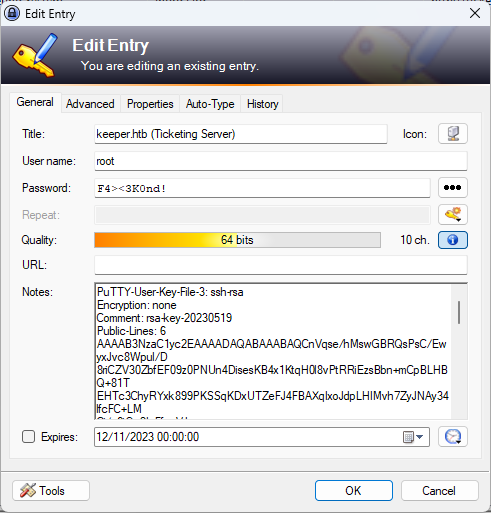

# [Keeper](https://app.hackthebox.com/machines/Keeper)

```
PORT   STATE SERVICE VERSION
22/tcp open  ssh     OpenSSH 8.9p1 Ubuntu 3ubuntu0.3 (Ubuntu Linux; protocol 2.0)
| ssh-hostkey:
|   256 3539d439404b1f6186dd7c37bb4b989e (ECDSA)
|_  256 1ae972be8bb105d5effedd80d8efc066 (ED25519)
80/tcp open  http    nginx 1.18.0 (Ubuntu)
|_http-title: Site doesn't have a title (text/html).
|_http-server-header: nginx/1.18.0 (Ubuntu)
Service Info: OS: Linux; CPE: cpe:/o:linux:linux_kernel
```

Checking the website on port 80 reveals [http://tickets.keeper.htb/rt/](http://tickets.keeper.htb/rt/) which is some kind of ticketing system named "Request Tracker" with version 4.4.4.
After some googling the default credentials of root:password do work.

Poking in the admin Panel we do find a user named lnorgaard.
In some Admin comment their standard password (Welcome2023!) is noted.
Which we can login with via SSH.


In the ticketing System there is also an open Ticket mentioning a crash dump of keepass.


After logging in we can see zip file in the users home directory.
Named RT30000.zip. Unzipped it reveals the crashdump and the .kdbx database which is encrypted with the master key.

Best guess is using [CVE-2023-32784](https://github.com/dawnl3ss/CVE-2023-32784) to dump the masterkey.

Trying to dump the masterkey seems weird at first


Googling "med flode" and with the weird username from earlier it seems we found the password: "rødgrød med fløde".

Checking out the Keepass Database we find a putty formatted ssh keypair.



Importing it into putty and reexporting it as openssh private key works and we are now able to log in as root.


