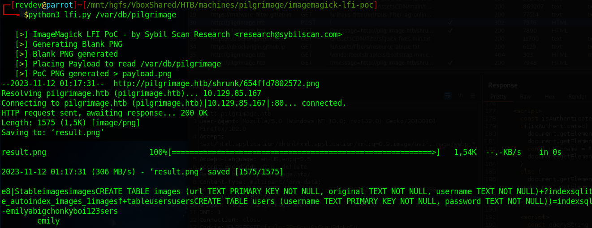
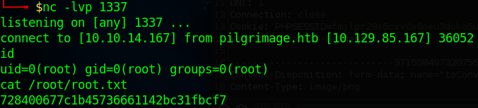

# [Pilgrimage](https://app.hackthebox.com/machines/Pilgrimage)

```
Nmap scan report for pilgrimage.htb (10.129.85.167)
Host is up (0.031s latency).
Not shown: 998 closed tcp ports (reset)
PORT   STATE SERVICE VERSION
22/tcp open  ssh     OpenSSH 8.4p1 Debian 5+deb11u1 (protocol 2.0)
| ssh-hostkey:
|   3072 20:be:60:d2:95:f6:28:c1:b7:e9:e8:17:06:f1:68:f3 (RSA)
|   256 0e:b6:a6:a8:c9:9b:41:73:74:6e:70:18:0d:5f:e0:af (ECDSA)
|_  256 d1:4e:29:3c:70:86:69:b4:d7:2c:c8:0b:48:6e:98:04 (ED25519)
80/tcp open  http    nginx 1.18.0
|_http-server-header: nginx/1.18.0
|_http-title: Pilgrimage - Shrink Your Images
| http-git:
|   10.129.85.167:80/.git/
|     Git repository found!
|     Repository description: Unnamed repository; edit this file 'description' to name the...
|_    Last commit message: Pilgrimage image shrinking service initial commit. # Please ...
| http-cookie-flags:
|   /:
|     PHPSESSID:
|_      httponly flag not set
Service Info: OS: Linux; CPE: cpe:/o:linux:linux_kernel
```

Having a public git repo is always pretty handy. We dump it using [GitTools](https://github.com/internetwache/GitTools/)

The source code reveals that the application is using imagemagick to process our input image:

```
exec("/var/www/pilgrimage.htb/magick convert /var/www/pilgrimage.htb/tmp/" . $upload->getName() . $mime . " -resize 50% /var/www/pilgrimage.htb/shrunk/" . $newname . $mime);
```

The exposed git repo also includes the imagemagick binary used.
Checking the version: "ImageMagick 7.1.0-49" shows us that it is probably vulnerable to [CVE-2022-44268](https://hackerone.com/reports/1858574)

To check it i used https://github.com/Sybil-Scan/imagemagick-lfi-poc and wrote a small python [wrapper script](lfi.py) that uploads the payload and extracts the information.

Extracting /etc/passwd via our wrapper

```
python3 lfi.py /etc/passwd

emily:x:1000:1000:emily,,,:/home/emily:/bin/bash
```

shows that there is a user on the machine named emily.

Checking the source that we got out of the git repo earlier we can see that there is a sqlite db located at "/var/db/pilgrimage"

running

```
python3 lfi.py /var/db/pilgrimage
```

successfully retrieves it exposing some juicy credentials



Trying to login via SSH gives us our shell and the user flag.

Running local enum we see that root is running a skript scanning uploads for malware.

```
/bin/bash /usr/sbin/malwarescan.sh

#!/bin/bash

blacklist=("Executable script" "Microsoft executable")

/usr/bin/inotifywait -m -e create /var/www/pilgrimage.htb/shrunk/ | while read FILE; do
	filename="/var/www/pilgrimage.htb/shrunk/$(/usr/bin/echo "$FILE" | /usr/bin/tail -n 1 | /usr/bin/sed -n -e 's/^.*CREATE //p')"
	binout="$(/usr/local/bin/binwalk -e "$filename")"
        for banned in "${blacklist[@]}"; do
		if [[ "$binout" == *"$banned"* ]]; then
			/usr/bin/rm "$filename"
			break
		fi
	done
done
```

Binwalk on our machine has version v2.3.2 which is vulnerable to [CVE-2022-4510](https://github.com/adhikara13/CVE-2022-4510-WalkingPath)
Using the provided Script we forge a file that we now are able to drop into the /var/www/pilgrimage.htb/shrunk/ folder which grants us a root shell.


