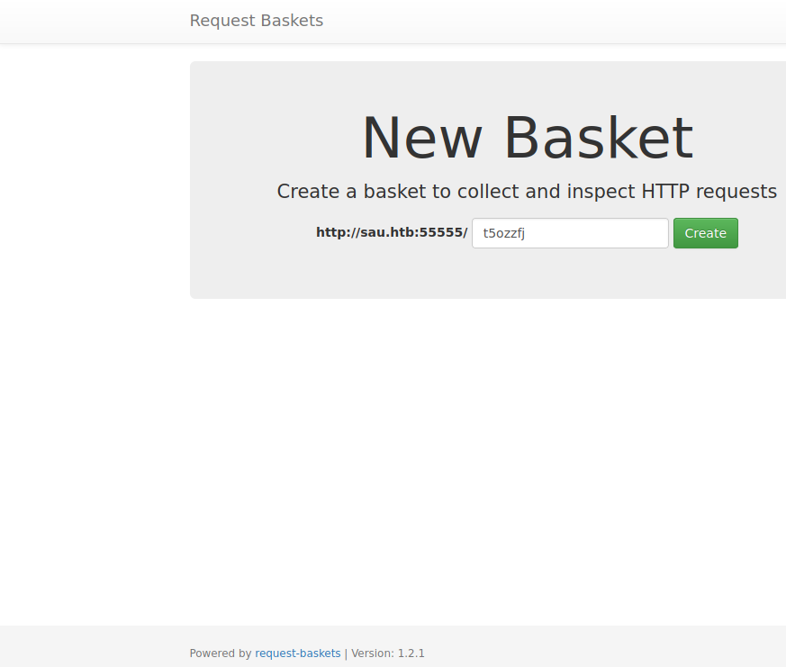
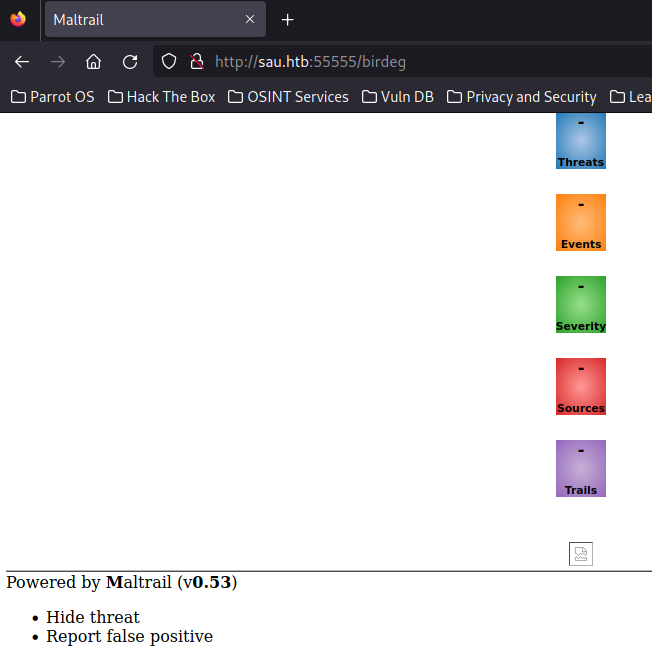
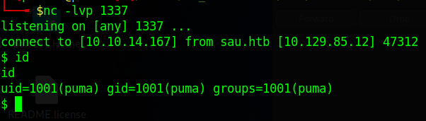
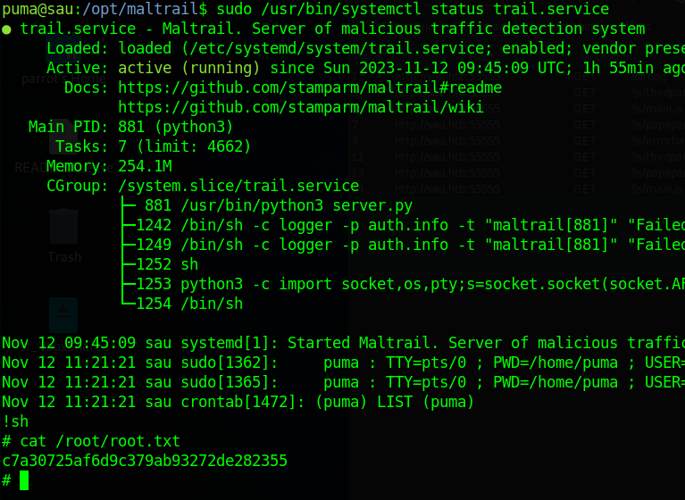

# [Sau](https://app.hackthebox.com/machines/Sau)

```
Nmap scan report for sau.htb (10.129.85.12)
Host is up (0.032s latency).
Not shown: 997 closed tcp ports (reset)
PORT      STATE    SERVICE VERSION
22/tcp    open     ssh     OpenSSH 8.2p1 Ubuntu 4ubuntu0.7 (Ubuntu Linux; protocol 2.0)
| ssh-hostkey:
|   3072 aa:88:67:d7:13:3d:08:3a:8a:ce:9d:c4:dd:f3:e1:ed (RSA)
|   256 ec:2e:b1:05:87:2a:0c:7d:b1:49:87:64:95:dc:8a:21 (ECDSA)
|_  256 b3:0c:47:fb:a2:f2:12:cc:ce:0b:58:82:0e:50:43:36 (ED25519)
80/tcp    filtered http
55555/tcp open     unknown
| fingerprint-strings:
|   FourOhFourRequest:
|     HTTP/1.0 400 Bad Request
|     Content-Type: text/plain; charset=utf-8
|     X-Content-Type-Options: nosniff
|     Date: Sun, 12 Nov 2023 09:49:41 GMT
|     Content-Length: 75
|     invalid basket name; the name does not match pattern: ^[wd-_\.]{1,250}$
|   GenericLines, Help, Kerberos, LDAPSearchReq, LPDString, RTSPRequest, SSLSessionReq, TLSSessionReq, TerminalServerCookie:
|     HTTP/1.1 400 Bad Request
|     Content-Type: text/plain; charset=utf-8
|     Connection: close
|     Request
|   GetRequest:
|     HTTP/1.0 302 Found
|     Content-Type: text/html; charset=utf-8
|     Location: /web
|     Date: Sun, 12 Nov 2023 09:49:15 GMT
|     Content-Length: 27
|     href="/web">Found</a>.
|   HTTPOptions:
|     HTTP/1.0 200 OK
|     Allow: GET, OPTIONS
|     Date: Sun, 12 Nov 2023 09:49:15 GMT
|_    Content-Length: 0
```

Visiting http://sau.htb:55555/ we are greeted with an application that is called Request Basket running with version 1.2.1.



Should be vulnerable to [CVE-2023-27163](https://github.com/entr0pie/CVE-2023-27163).
It enables us to fully interact with services that are bound to localhost.
Using the script we can now interact with the previously found http server on port 80.



Maltrail with version 0.53 is vulnerable to an RCE.
This [POC](https://github.com/spookier/Maltrail-v0.53-Exploit) gives us an effortless shell.



We now have access to low priv user and the user flag.
Since ssh is open we can drop our public key into /home/puma/.ssh/authorized_keys to get a stable shell.

Puma has some nice privs:

```
User puma may run the following commands on sau:
    (ALL : ALL) NOPASSWD: /usr/bin/systemctl status trail.service
```

The service looks like that:

```
[Unit]
Description=Maltrail. Server of malicious traffic detection system
Documentation=https://github.com/stamparm/maltrail#readme
Documentation=https://github.com/stamparm/maltrail/wiki
Requires=network.target
Before=maltrail-sensor.service
After=network-online.target

[Service]
User=puma
Group=puma
WorkingDirectory=/opt/maltrail
ExecStart=/usr/bin/python3 server.py
Restart=on-failure
KillMode=mixed

[Install]
WantedBy=multi-user.target
```

Both the service and server.py that it executes is readonly for us.
Whats nice though, we can execute systemctl as root which invokes less as root. https://gtfobins.github.io/gtfobins/systemctl/

Once inside we can now use "!sh" to gain access to our well deserved root shell.


